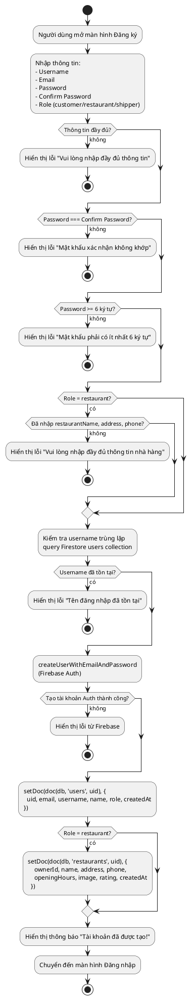
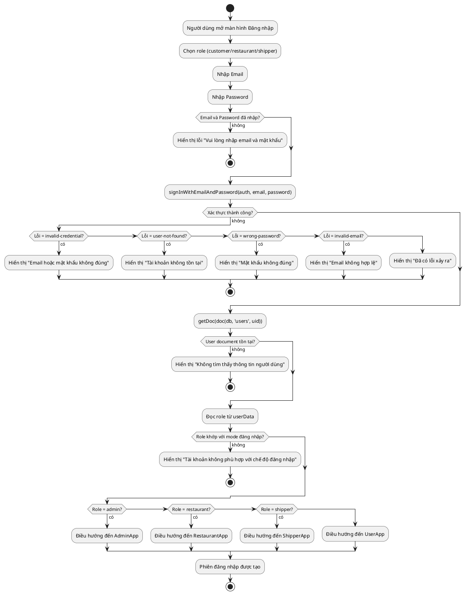
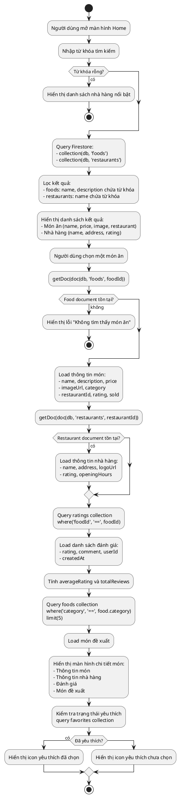
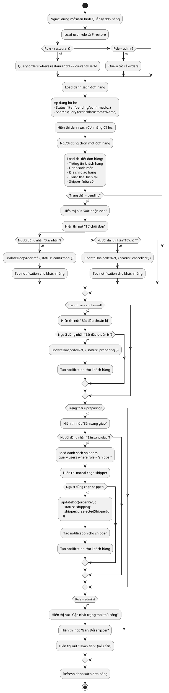
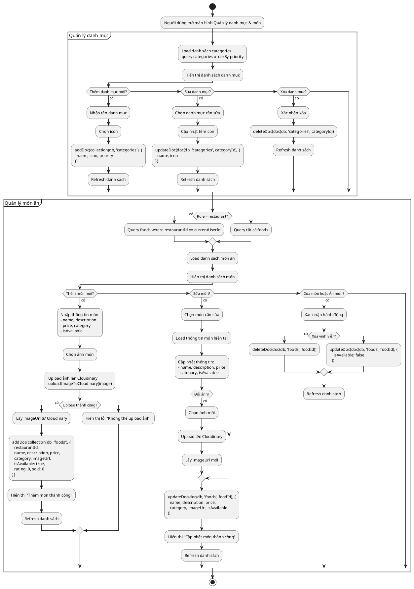
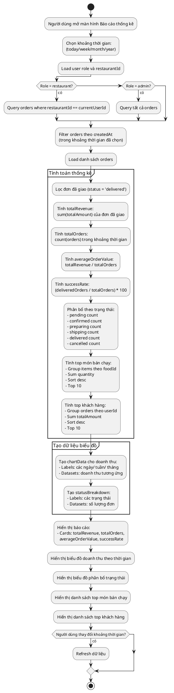

# BIỂU ĐỒ HOẠT ĐỘNG - FOOD ORDER APP

Tài liệu mô tả biểu đồ hoạt động (Activity Diagram) cho các chức năng chính trong hệ thống Food Order App. Mỗi biểu đồ được vẽ bằng PlantUML và mô tả chi tiết luồng xử lý từ đầu đến cuối.

---

## 1. Đăng ký tài khoản

**Tên**: Đăng ký tài khoản

**Actor**: Khách hàng, Nhà hàng, Shipper

**Yêu cầu**: 
- Người dùng chưa có tài khoản trong hệ thống
- Có kết nối internet
- Nhập đầy đủ thông tin bắt buộc

**Luồng dữ liệu**:
1. Người dùng nhập thông tin: username, email, password, confirmPassword, role
2. Hệ thống kiểm tra username trùng lặp trong Firestore `users`
3. Hệ thống tạo tài khoản Firebase Auth với email/password
4. Lưu thông tin vào Firestore `users/{uid}` với role tương ứng
5. Nếu role = 'restaurant', tạo document trong `restaurants/{uid}`
6. Gửi thông báo kết quả

**Kết quả**: 
- Tài khoản mới được tạo trong Firebase Auth và Firestore
- Người dùng có thể đăng nhập với email/password
- Nếu là nhà hàng, có document trong collection `restaurants`



---

## 2. Đăng nhập tài khoản

**Tên**: Đăng nhập tài khoản

**Actor**: Khách hàng, Nhà hàng, Shipper, Admin

**Yêu cầu**:
- Tài khoản đã được tạo trong hệ thống
- Trạng thái tài khoản không bị khóa
- Có kết nối internet

**Luồng dữ liệu**:
1. Người dùng nhập email và password
2. Hệ thống xác thực với Firebase Auth (`signInWithEmailAndPassword`)
3. Lấy thông tin user từ Firestore `users/{uid}`
4. Kiểm tra role và điều hướng theo role:
   - `customer` → UserApp
   - `restaurant` → RestaurantApp
   - `shipper` → ShipperApp
   - `admin` → AdminApp
5. Lưu phiên đăng nhập

**Kết quả**:
- Người dùng đăng nhập thành công
- Điều hướng đến ứng dụng phù hợp với role
- Token phiên được lưu trong Firebase Auth



---

## 3. Tìm kiếm và xem chi tiết món ăn

**Tên**: Tìm kiếm và xem chi tiết món ăn

**Actor**: Khách hàng

**Yêu cầu**:
- Đã đăng nhập (hoặc có thể duyệt không cần đăng nhập)
- Có kết nối internet

**Luồng dữ liệu**:
1. Người dùng nhập từ khóa tìm kiếm
2. Hệ thống query Firestore `foods` và `restaurants` với từ khóa
3. Lọc kết quả theo tên món, tên nhà hàng
4. Hiển thị danh sách kết quả
5. Người dùng chọn món → xem chi tiết
6. Load thông tin món từ `foods/{foodId}`
7. Load thông tin nhà hàng từ `restaurants/{restaurantId}`
8. Load đánh giá từ `ratings` collection
9. Load món đề xuất dựa trên category

**Kết quả**:
- Hiển thị danh sách món ăn và nhà hàng phù hợp
- Hiển thị chi tiết món ăn với đầy đủ thông tin
- Hiển thị đánh giá và món đề xuất



---

## 4. Đặt món và theo dõi đơn hàng

**Tên**: Đặt món và theo dõi đơn hàng

**Actor**: Khách hàng

**Yêu cầu**:
- Đã đăng nhập
- Có sản phẩm trong giỏ hàng
- Đã chọn địa chỉ giao hàng
- Có kết nối internet

**Luồng dữ liệu**:
1. Người dùng xem giỏ hàng từ `carts` collection
2. Chọn địa chỉ giao hàng hoặc thêm địa chỉ mới
3. Chọn phương thức thanh toán
4. Áp dụng voucher (nếu có)
5. Tính tổng tiền: subtotal + deliveryFee - voucherDiscount
6. Tạo đơn hàng trong `orders` collection
7. Tạo notification cho khách hàng
8. Xóa giỏ hàng
9. Theo dõi đơn hàng real-time với `onSnapshot`
10. Cập nhật trạng thái đơn hàng

**Kết quả**:
- Đơn hàng được tạo trong Firestore
- Khách hàng nhận thông báo
- Có thể theo dõi trạng thái đơn hàng real-time

```plantuml
@startuml
start

:Người dùng mở màn hình Giỏ hàng;
:Load giỏ hàng từ Firestore\nquery carts collection where userId;

if (Giỏ hàng trống?) then (có)
  :Hiển thị "Giỏ hàng trống";
  stop
endif

:Hiển thị danh sách món trong giỏ hàng;

:Người dùng nhấn "Thanh toán";

:Load danh sách địa chỉ từ user.addresses;

if (Chưa có địa chỉ?) then (có)
  :Chuyển đến màn hình Thêm địa chỉ;
  :Người dùng nhập địa chỉ mới;
  :Lưu địa chỉ vào Firestore;
endif

:Chọn địa chỉ giao hàng;
:Chọn phương thức thanh toán\n(COD/Ví điện tử/Thẻ);

:Load danh sách voucher khả dụng\nquery vouchers collection;

if (Có voucher áp dụng?) then (có)
  :Chọn voucher;
  :Tính voucherDiscount;
endif

:Tính tổng tiền:\nsubtotal + deliveryFee - voucherDiscount;

:Người dùng xác nhận đặt hàng;

:Group items theo restaurantId;

partition "Tạo đơn hàng" {
  for each (restaurantId, items) do
    :Tạo order payload:\n- userId, restaurantId\n- items, address\n- paymentMethod, voucher\n- totalAmount, status: 'pending';
    
    :addDoc(collection(db, 'orders'), orderPayload);
    
    :Tạo notification cho khách hàng\naddDoc(collection(db, 'notifications'), {\n  to: userId,\n  type: 'order',\n  title: 'Đặt đơn thành công',\n  orderId\n});
  endfor
end

:Xóa giỏ hàng\ndeleteDoc(doc(db, 'carts', cartId));

:Hiển thị thông báo "Đặt hàng thành công";
:Chuyển đến màn hình Đơn hàng;

partition "Theo dõi đơn hàng" {
  :onSnapshot(doc(db, 'orders', orderId), (snapshot) => {\n  // Cập nhật UI real-time\n});
  
  if (Status = 'pending'?) then (có)
    :Hiển thị "Chờ xác nhận";
  else if (Status = 'confirmed'?) then (có)
    :Hiển thị "Đã xác nhận";
  else if (Status = 'preparing'?) then (có)
    :Hiển thị "Đang chuẩn bị";
  else if (Status = 'shipping'?) then (có)
    :Hiển thị "Đang giao";
    :Load vị trí shipper real-time;
    :Hiển thị bản đồ tracking;
  else if (Status = 'delivered'?) then (có)
    :Hiển thị "Đã giao";
    :Hiển thị nút "Đánh giá";
  else if (Status = 'cancelled'?) then (có)
    :Hiển thị "Đã hủy";
  endif
}

stop
@enduml
```

---

## 5. Quản lý đơn hàng

**Tên**: Quản lý đơn hàng

**Actor**: Nhà hàng, Admin

**Yêu cầu**:
- Đã đăng nhập với role `restaurant` hoặc `admin`
- Có quyền truy cập đơn hàng

**Luồng dữ liệu**:
1. Load danh sách đơn hàng từ `orders` collection
2. Lọc theo restaurantId (nếu là nhà hàng) hoặc tất cả (nếu là admin)
3. Lọc theo trạng thái (pending, confirmed, preparing, shipping, delivered, cancelled)
4. Tìm kiếm theo mã đơn hàng hoặc tên khách hàng
5. Xem chi tiết đơn hàng
6. Cập nhật trạng thái đơn hàng
7. Gán shipper cho đơn hàng (nếu cần)
8. Tạo notification cho khách hàng khi trạng thái thay đổi

**Kết quả**:
- Đơn hàng được quản lý và cập nhật trạng thái
- Khách hàng nhận thông báo về thay đổi trạng thái
- Shipper được gán và nhận thông báo



---

## 6. Quản lý danh mục và món

**Tên**: Quản lý danh mục và món

**Actor**: Nhà hàng, Admin

**Yêu cầu**:
- Đã đăng nhập với role `restaurant` hoặc `admin`
- Có quyền quản lý menu

**Luồng dữ liệu**:
1. **Quản lý danh mục**:
   - Load danh sách categories từ `categories` collection
   - Thêm/Sửa/Xóa danh mục
   - Lưu vào Firestore với priority
2. **Quản lý món ăn**:
   - Load danh sách foods từ `foods` collection (filter theo restaurantId nếu là nhà hàng)
   - Thêm món mới: name, description, price, category, imageUrl
   - Sửa món: cập nhật thông tin
   - Xóa món hoặc đặt isAvailable = false
   - Upload ảnh món lên Cloudinary
   - Lưu vào Firestore

**Kết quả**:
- Danh mục được quản lý và hiển thị trong menu
- Món ăn được thêm/sửa/xóa thành công
- Ảnh món được lưu trên Cloudinary và URL lưu trong Firestore



---

## 7. Báo cáo thống kê cho nhà hàng

**Tên**: Báo cáo thống kê cho nhà hàng

**Actor**: Nhà hàng, Admin

**Yêu cầu**:
- Đã đăng nhập với role `restaurant` hoặc `admin`
- Có đơn hàng trong hệ thống

**Luồng dữ liệu**:
1. Chọn khoảng thời gian (hôm nay, tuần, tháng, năm)
2. Query orders từ `orders` collection:
   - Filter theo restaurantId (nếu là nhà hàng)
   - Filter theo createdAt trong khoảng thời gian
   - Filter theo status = 'delivered' để tính doanh thu
3. Tính toán thống kê:
   - Tổng doanh thu (totalRevenue)
   - Tổng số đơn (totalOrders)
   - Giá trị đơn trung bình (averageOrderValue)
   - Tỷ lệ thành công (successRate)
   - Phân bổ theo trạng thái
   - Top món bán chạy
   - Top khách hàng
4. Tạo dữ liệu biểu đồ:
   - Biểu đồ doanh thu theo thời gian
   - Biểu đồ phân bổ trạng thái đơn hàng
5. Hiển thị báo cáo và biểu đồ

**Kết quả**:
- Báo cáo thống kê được hiển thị với đầy đủ số liệu
- Biểu đồ trực quan hóa dữ liệu
- Nhà hàng có thể đánh giá hiệu suất kinh doanh



---

## 8. Quản lý đơn hàng cho shipper

**Tên**: Quản lý đơn hàng cho shipper

**Actor**: Shipper

**Yêu cầu**:
- Đã đăng nhập với role `shipper`
- Có đơn hàng khả dụng hoặc đã được gán

**Luồng dữ liệu**:
1. Load danh sách đơn hàng:
   - Đơn khả dụng: status = 'preparing' hoặc 'confirmed', chưa có shipperId
   - Đơn đã nhận: shipperId = currentUserId, status in ['accepted', 'picking', 'delivering']
2. Hiển thị danh sách đơn với thông tin: địa chỉ lấy, địa chỉ giao, tổng tiền
3. Shipper nhận đơn:
   - Kiểm tra đơn chưa được shipper khác nhận
   - Cập nhật order: shipperId = currentUserId, status = 'accepted'
   - Tạo notification cho khách hàng và nhà hàng
4. Cập nhật trạng thái đơn:
   - 'accepted' → 'picking' (đang đến lấy)
   - 'picking' → 'delivering' (đang giao)
   - 'delivering' → 'delivered' (đã giao)
5. Xử lý giao hàng thất bại (nếu có):
   - Cập nhật status = 'failed'
   - Nhập lý do thất bại
6. Theo dõi vị trí real-time trên bản đồ

**Kết quả**:
- Shipper nhận và quản lý đơn hàng thành công
- Trạng thái đơn hàng được cập nhật real-time
- Khách hàng và nhà hàng nhận thông báo

```plantuml
@startuml
start

:Shipper mở màn hình Đơn hàng;

:Load user.uid;

partition "Load đơn khả dụng" {
  :Query orders where:\n  status in ['preparing', 'confirmed']\n  AND shipperId == null;
  
  :Hiển thị tab "Đơn khả dụng";
}

partition "Load đơn đã nhận" {
  :Query orders where:\n  shipperId == currentUserId\n  AND status in ['accepted', 'picking', 'delivering'];
  
  :Hiển thị tab "Đơn của tôi";
}

:Hiển thị danh sách đơn:\n- Mã đơn, nhà hàng\n- Địa chỉ lấy, địa chỉ giao\n- Tổng tiền, khoảng cách;

:Shipper chọn một đơn hàng;

if (Đơn trong tab "Khả dụng"?) then (có)
  :Xem chi tiết đơn:\n- Thông tin khách hàng\n- Danh sách món\n- Địa chỉ lấy và giao\n- Ghi chú;
  
  :Shipper nhấn "Nhận đơn";
  
  :Kiểm tra đơn chưa được nhận\n(getDoc order);
  
  if (Đơn đã có shipperId khác?) then (có)
    :Hiển thị "Đơn đã được shipper khác nhận";
    stop
  endif
  
  :updateDoc(orderRef, {\n    shipperId: currentUserId,\n    status: 'accepted',\n    acceptedAt: new Date()\n  });
  
  :Tạo notification cho khách hàng;
  :Tạo notification cho nhà hàng;
  
  :Hiển thị "Đã nhận đơn thành công";
  :Refresh danh sách;
endif

if (Đơn trong tab "Của tôi"?) then (có)
  :Xem chi tiết đơn;
  
  if (Status = 'accepted'?) then (có)
    :Hiển thị nút "Đang đến lấy";
    
    if (Shipper nhấn "Đang đến lấy"?) then (có)
      :updateDoc(orderRef, {\n        status: 'picking',\n        pickingAt: new Date()\n      });
      :Tạo notification cho khách hàng;
    endif
  endif
  
  if (Status = 'picking'?) then (có)
    :Hiển thị nút "Đã lấy hàng - Bắt đầu giao";
    
    if (Shipper nhấn "Bắt đầu giao"?) then (có)
      :updateDoc(orderRef, {\n        status: 'delivering',\n        deliveringAt: new Date()\n      });
      :Tạo notification cho khách hàng;
    endif
  endif
  
  if (Status = 'delivering'?) then (có)
    :Hiển thị nút "Đã giao thành công";
    :Hiển thị nút "Giao hàng thất bại";
    
    if (Shipper nhấn "Đã giao thành công"?) then (có)
      :updateDoc(orderRef, {\n        status: 'delivered',\n        deliveredAt: new Date()\n      });
      :Tính toán thu nhập cho shipper\n(cập nhật wallet);
      :Tạo notification cho khách hàng;
      :Tạo notification cho nhà hàng;
      :Hiển thị "Giao hàng thành công";
    else if (Shipper nhấn "Giao hàng thất bại"?) then (có)
      :Hiển thị modal nhập lý do;
      :Nhập lý do thất bại;
      :updateDoc(orderRef, {\n        status: 'failed',\n        failureReason: reason,\n        failedAt: new Date()\n      });
      :Tạo notification cho khách hàng;
      :Tạo notification cho nhà hàng;
    endif
  endif
  
  :Hiển thị bản đồ tracking\n(địa chỉ lấy → địa chỉ giao);
  
  :Cập nhật vị trí shipper real-time\n(Location.getCurrentPositionAsync);
  
  :updateDoc(orderRef, {\n    shipperLocation: { lat, lng }\n  });
endif

:Refresh danh sách đơn;

stop
@enduml
```



---

## 9. Quản lý thu nhập cho Shipper

**Tên**: Quản lý thu nhập cho Shipper

**Actor**: Shipper

**Yêu cầu**:
- Đã đăng nhập với role `shipper`
- Đã có đơn hàng đã giao thành công

**Luồng dữ liệu**:
1. Load thông tin ví từ `users/{uid}.wallet`:
   - balance (số dư khả dụng)
   - debt (công nợ)
   - pendingWithdraw (đang chờ rút)
   - totalWithdrawn (đã rút)
2. Load lịch sử đơn hàng đã giao:
   - Query orders where shipperId = currentUserId AND status = 'delivered'
   - Tính toán thu nhập từ mỗi đơn (phí giao hàng)
3. Tính toán thống kê:
   - Tổng thu nhập (today, week, month, all)
   - Số đơn đã giao
   - Thu nhập trung bình mỗi đơn
4. Load lịch sử rút tiền:
   - Query withdrawRequests where shipperId = currentUserId
5. Tạo yêu cầu rút tiền:
   - Nhập số tiền rút
   - Nhập thông tin ngân hàng (accountNumber, bankName, accountName)
   - Kiểm tra số tiền <= balance
   - Tạo document trong `withdrawRequests`
   - Cập nhật wallet: balance -= amount, pendingWithdraw += amount
6. Hiển thị lịch sử và trạng thái rút tiền

**Kết quả**:
- Shipper xem được tổng quan thu nhập
- Có thể tạo yêu cầu rút tiền
- Theo dõi lịch sử giao dịch và rút tiền

```plantuml
@startuml
start

:Shipper mở màn hình Tài chính;

:Load user.uid;

:getDoc(doc(db, 'users', uid));

:Đọc thông tin wallet:\n- balance\n- debt\n- pendingWithdraw\n- totalWithdrawn;

:Hiển thị thông tin ví:\n- Số dư khả dụng\n- Công nợ\n- Đang chờ rút\n- Đã rút;

partition "Load lịch sử đơn hàng" {
  :Query orders where:\n  shipperId == currentUserId\n  AND status == 'delivered';
  
  :Tính thu nhập từ mỗi đơn\n(deliveryFee hoặc % từ totalAmount);
  
  :Lọc theo khoảng thời gian:\n- today\n- week\n- month\n- all;
  
  :Tính toán thống kê:\n- total: tổng thu nhập\n- count: số đơn đã giao\n- average: thu nhập trung bình;
  
  :Hiển thị thống kê;
  
  :Hiển thị danh sách đơn đã giao:\n- Mã đơn, ngày giao\n- Thu nhập từ đơn;
}

partition "Load lịch sử rút tiền" {
  :Query withdrawRequests where:\n  shipperId == currentUserId\n  orderBy createdAt desc;
  
  :Hiển thị danh sách yêu cầu rút:\n- Số tiền\n- Thông tin ngân hàng\n- Trạng thái (pending/approved/rejected)\n- Ngày tạo;
}

:Shipper nhấn "Rút tiền";

:Hiển thị modal rút tiền;

:Nhập số tiền rút;

if (Số tiền <= 0?) then (có)
  :Hiển thị lỗi "Số tiền không hợp lệ";
  stop
endif

if (Số tiền > balance?) then (có)
  :Hiển thị lỗi "Số tiền vượt quá số dư";
  stop
endif

:Nhập thông tin ngân hàng:\n- Số tài khoản\n- Tên ngân hàng\n- Tên chủ tài khoản;

if (Thông tin ngân hàng đầy đủ?) then (không)
  :Hiển thị lỗi "Vui lòng nhập đầy đủ thông tin";
  stop
endif

:Xác nhận rút tiền;

:addDoc(collection(db, 'withdrawRequests'), {\n  shipperId,\n  amount,\n  bankInfo,\n  status: 'pending',\n  createdAt: new Date()\n});

:updateDoc(doc(db, 'users', uid), {\n  'wallet.balance': balance - amount,\n  'wallet.pendingWithdraw': pendingWithdraw + amount,\n  bankInfo\n});

:Hiển thị "Yêu cầu rút tiền đã được gửi";

:Refresh thông tin ví;

:Refresh lịch sử rút tiền;

stop
@enduml
```



---

## 10. Quản lý người dùng cho admin

**Tên**: Quản lý người dùng cho admin

**Actor**: Admin

**Yêu cầu**:
- Đã đăng nhập với role `admin`
- Có quyền quản lý tất cả người dùng

**Luồng dữ liệu**:
1. Load danh sách users từ `users` collection
2. Lọc và tìm kiếm:
   - Lọc theo role (customer, restaurant, shipper, admin)
   - Lọc theo status (active, locked)
   - Lọc theo city
   - Tìm kiếm theo name, email, phone, id
3. Tính toán metadata:
   - Số đơn hàng của mỗi user (query orders where userId)
   - Tổng chi tiêu (sum totalAmount từ orders)
4. Xem chi tiết user:
   - Thông tin cá nhân
   - Lịch sử đơn hàng
   - Trạng thái tài khoản
5. Thao tác quản lý:
   - Khóa/Mở khóa tài khoản (toggle status: active ↔ locked)
   - Xóa tài khoản (delete user document)
   - Tạo tài khoản mới (createUserWithEmailAndPassword + setDoc)
   - Cập nhật thông tin user
6. Hiển thị thống kê:
   - Tổng số users theo role
   - Số users mới (7 ngày qua)
   - Số users active/locked

**Kết quả**:
- Admin quản lý được tất cả người dùng trong hệ thống
- Tài khoản được khóa/mở khóa thành công
- Thống kê người dùng được cập nhật

```plantuml
@startuml
start

:Admin mở màn hình Quản lý người dùng;

:Query tất cả users từ Firestore;

:Load danh sách users;

partition "Tính toán metadata" {
  for each (user) do
    :Query orders where userId == user.id;
    :Đếm số đơn hàng;
    :Tính tổng chi tiêu\nsum(totalAmount) từ orders delivered;
    :Gán orderCount và totalSpent vào user;
  endfor
}

:Áp dụng bộ lọc:\n- Role filter (customer/restaurant/shipper/admin)\n- Status filter (active/locked)\n- City filter\n- Search query (name/email/phone/id);

:Hiển thị danh sách users đã lọc:\n- Avatar, name, email, phone\n- Role, status\n- Order count, total spent\n- Created date;

:Admin chọn một user;

:Hiển thị chi tiết user:\n- Thông tin cá nhân\n- Role, status\n- Lịch sử đơn hàng\n- Tổng chi tiêu;

if (Khóa/Mở khóa tài khoản?) then (có)
  :Xác nhận hành động;
  
  if (Status hiện tại = 'active'?) then (có)
    :updateDoc(userRef, { status: 'locked' });
    :Hiển thị "Đã khóa tài khoản";
  else
    :updateDoc(userRef, { status: 'active' });
    :Hiển thị "Đã mở khóa tài khoản";
  endif
  
  :Refresh danh sách;
endif

if (Xóa tài khoản?) then (có)
  :Xác nhận xóa;
  :deleteDoc(doc(db, 'users', userId));
  :Hiển thị "Đã xóa tài khoản";
  :Refresh danh sách;
endif

if (Tạo tài khoản mới?) then (có)
  :Nhập thông tin:\n- name, email, phone\n- password, role, city;
  
  :createUserWithEmailAndPassword(auth, email, password);
  
  :setDoc(doc(db, 'users', uid), {\n    name, email, phone,\n    role, status: 'active',\n    city, createdAt: new Date()\n  });
  
  :Hiển thị "Tạo tài khoản thành công";
  :Refresh danh sách;
endif

if (Cập nhật thông tin user?) then (có)
  :Chọn user cần sửa;
  :Cập nhật thông tin:\n- name, phone, city\n- role (nếu cần);
  
  :updateDoc(userRef, updates);
  
  :Hiển thị "Cập nhật thành công";
  :Refresh danh sách;
endif

partition "Hiển thị thống kê" {
  :Tính tổng số users theo role;
  :Tính số users mới (7 ngày qua);
  :Tính số users active/locked;
  
  :Hiển thị thống kê:\n- Cards: Total users, New users,\n  Active users, Locked users;
}

stop
@enduml
```

---

## 11. Quản lý khuyến mãi cho admin

**Tên**: Quản lý khuyến mãi cho admin

**Actor**: Admin

**Yêu cầu**:
- Đã đăng nhập với role `admin`
- Có quyền tạo và quản lý khuyến mãi

**Luồng dữ liệu**:
1. Load danh sách promotions từ `promotions` collection
2. Lọc và tìm kiếm:
   - Lọc theo status (scheduled, active, paused, expired)
   - Tìm kiếm theo title, code
3. Xem chi tiết promotion:
   - Thông tin chương trình (title, code, description)
   - Loại giảm giá (percentage/amount)
   - Giá trị giảm giá
   - Điều kiện (minOrderValue, usageLimit)
   - Thời gian (startDate, endDate)
   - Số lần sử dụng (usedCount)
4. Tạo promotion mới:
   - Nhập thông tin: title, code, description
   - Chọn discountType (percentage/amount)
   - Nhập discountValue
   - Nhập minOrderValue (nếu có)
   - Nhập usageLimit (nếu có)
   - Chọn startDate và endDate
   - Tính status dựa trên ngày (scheduled/active/expired)
   - Lưu vào Firestore
5. Sửa promotion:
   - Chọn promotion cần sửa
   - Cập nhật thông tin
   - Lưu vào Firestore
6. Xóa promotion:
   - Xác nhận xóa
   - deleteDoc từ Firestore
7. Tính toán thống kê:
   - Tổng số promotions
   - Số promotions đang chạy
   - Tổng số lần sử dụng
   - Tổng giá trị giảm giá đã áp dụng (từ orders có voucherId)

**Kết quả**:
- Promotion được tạo/sửa/xóa thành công
- Thống kê khuyến mãi được cập nhật
- Promotion có thể được sử dụng bởi khách hàng

```plantuml
@startuml
start

:Admin mở màn hình Quản lý khuyến mãi;

:Query promotions từ Firestore\norderBy createdAt desc;

:Load danh sách promotions;

:Áp dụng bộ lọc:\n- Status filter (scheduled/active/paused/expired)\n- Search query (title/code);

:Hiển thị danh sách promotions:\n- Title, code\n- Discount type & value\n- Status, thời gian\n- Used count;

if (Tạo promotion mới?) then (có)
  :Nhập thông tin:\n- title, code, description\n- discountType (percentage/amount)\n- discountValue\n- minOrderValue (optional)\n- usageLimit (optional)\n- startDate, endDate;
  
  if (Thông tin hợp lệ?) then (không)
    :Hiển thị lỗi;
    stop
  endif
  
  if (endDate < startDate?) then (có)
    :Hiển thị lỗi "Ngày kết thúc phải sau ngày bắt đầu";
    stop
  endif
  
  :Tính status:\n- Nếu now < startDate: 'scheduled'\n- Nếu now > endDate: 'expired'\n- Ngược lại: 'active';
  
  :addDoc(collection(db, 'promotions'), {\n    title, code, description,\n    discountType, discountValue,\n    minOrderValue, usageLimit,\n    startDate, endDate,\n    status, usedCount: 0,\n    createdAt: new Date()\n  });
  
  :Hiển thị "Tạo khuyến mãi thành công";
  :Refresh danh sách;
endif

if (Sửa promotion?) then (có)
  :Chọn promotion cần sửa;
  :Load thông tin promotion hiện tại;
  
  :Cập nhật thông tin:\n- title, description\n- discountType, discountValue\n- minOrderValue, usageLimit\n- startDate, endDate;
  
  :Tính lại status;
  
  :updateDoc(doc(db, 'promotions', promotionId), updates);
  
  :Hiển thị "Cập nhật khuyến mãi thành công";
  :Refresh danh sách;
endif

if (Xóa promotion?) then (có)
  :Xác nhận xóa;
  :deleteDoc(doc(db, 'promotions', promotionId));
  :Hiển thị "Đã xóa khuyến mãi";
  :Refresh danh sách;
endif

if (Tạm dừng/Kích hoạt promotion?) then (có)
  :Chọn promotion;
  
  if (Status = 'active'?) then (có)
    :updateDoc(promotionRef, { status: 'paused' });
    :Hiển thị "Đã tạm dừng khuyến mãi";
  else if (Status = 'paused'?) then (có)
    :updateDoc(promotionRef, { status: 'active' });
    :Hiển thị "Đã kích hoạt khuyến mãi";
  endif
  
  :Refresh danh sách;
endif

partition "Tính toán thống kê" {
  :Đếm tổng số promotions;
  :Đếm số promotions đang chạy (status = 'active');
  :Tính tổng usedCount từ tất cả promotions;
  
  :Query orders có voucherId\nđể tính tổng giá trị giảm giá đã áp dụng;
  
  :Tính tổng voucherDiscount từ orders;
  
  :Hiển thị thống kê:\n- Cards: Total promotions,\n  Active promotions,\n  Total usage,\n  Total discount applied;
}

:Admin xem chi tiết promotion;

:Hiển thị thông tin chi tiết:\n- Title, code, description\n- Discount type & value\n- Điều kiện sử dụng\n- Thời gian hiệu lực\n- Số lần sử dụng\n- Danh sách orders đã sử dụng (nếu có);

stop
@enduml
```



---

## Tổng kết

Tài liệu này mô tả 11 biểu đồ hoạt động chính của hệ thống Food Order App, bao gồm:

1. **Đăng ký tài khoản**: Quy trình tạo tài khoản mới cho khách hàng, nhà hàng, shipper
2. **Đăng nhập tài khoản**: Quy trình xác thực và điều hướng theo role
3. **Tìm kiếm và xem chi tiết món ăn**: Quy trình tìm kiếm, xem chi tiết và đánh giá món ăn
4. **Đặt món và theo dõi đơn hàng**: Quy trình đặt hàng và tracking real-time
5. **Quản lý đơn hàng**: Quy trình nhà hàng/admin quản lý và cập nhật trạng thái đơn
6. **Quản lý danh mục và món**: Quy trình CRUD danh mục và món ăn
7. **Báo cáo thống kê cho nhà hàng**: Quy trình tính toán và hiển thị báo cáo
8. **Quản lý đơn hàng cho shipper**: Quy trình shipper nhận và cập nhật trạng thái đơn
9. **Quản lý thu nhập cho Shipper**: Quy trình xem thu nhập và rút tiền
10. **Quản lý người dùng cho admin**: Quy trình admin quản lý tất cả users
11. **Quản lý khuyến mãi cho admin**: Quy trình tạo và quản lý chương trình khuyến mãi

Tất cả các biểu đồ được vẽ bằng PlantUML và có thể được render trực tiếp để xem sơ đồ hoạt động chi tiết.

