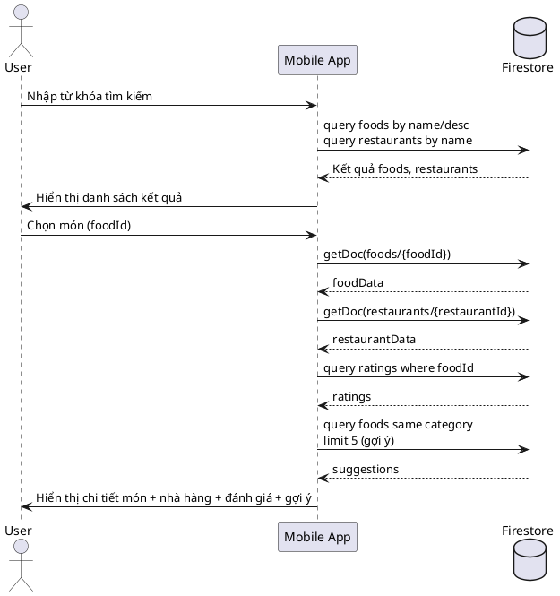
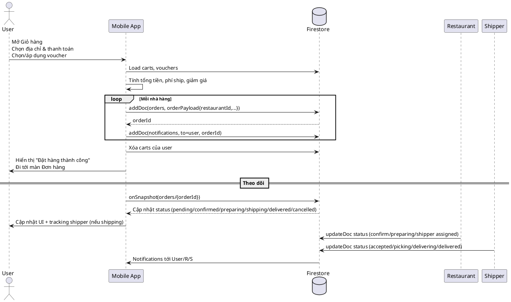
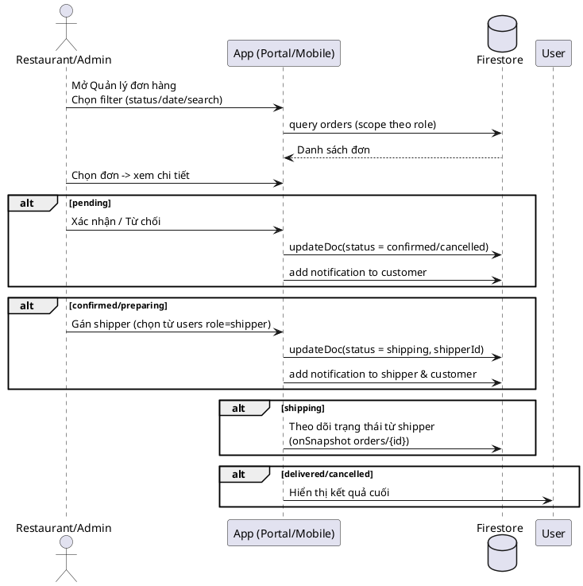
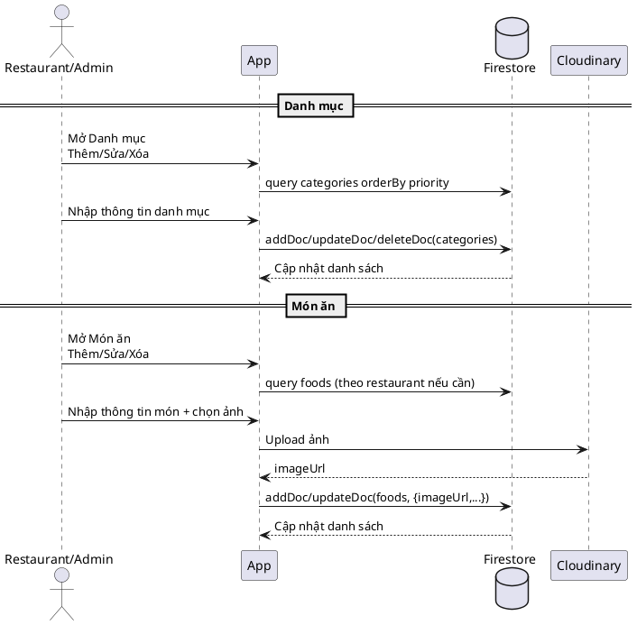
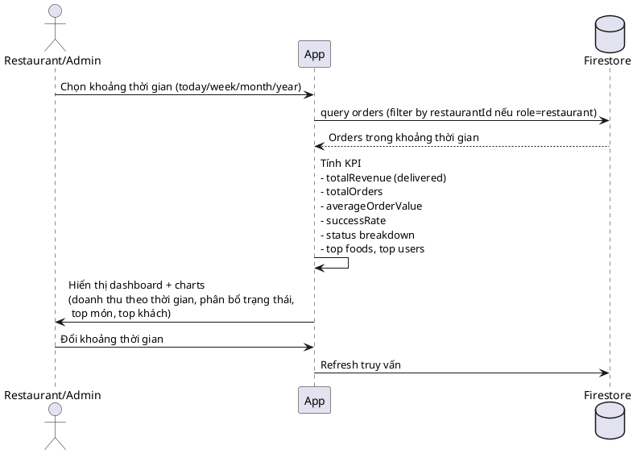
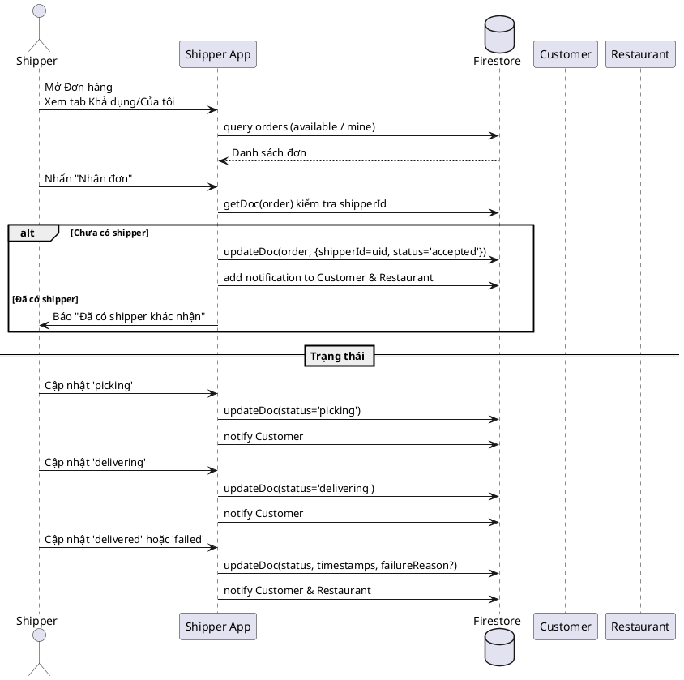
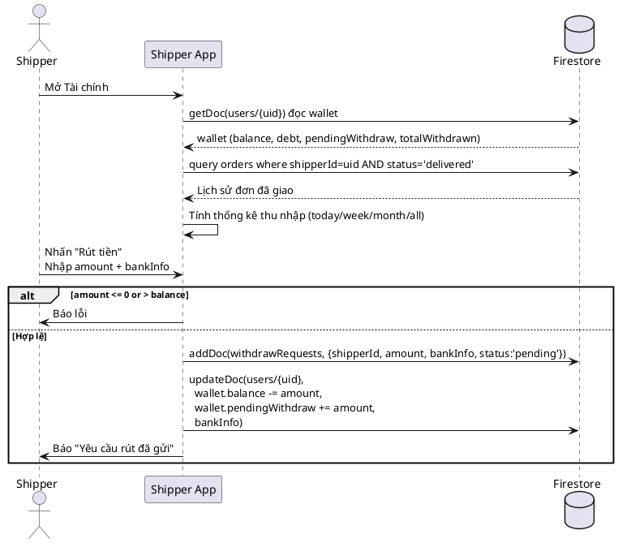
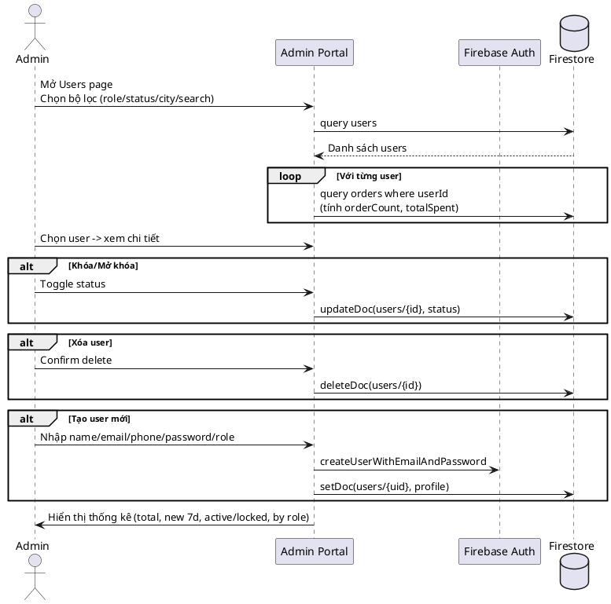
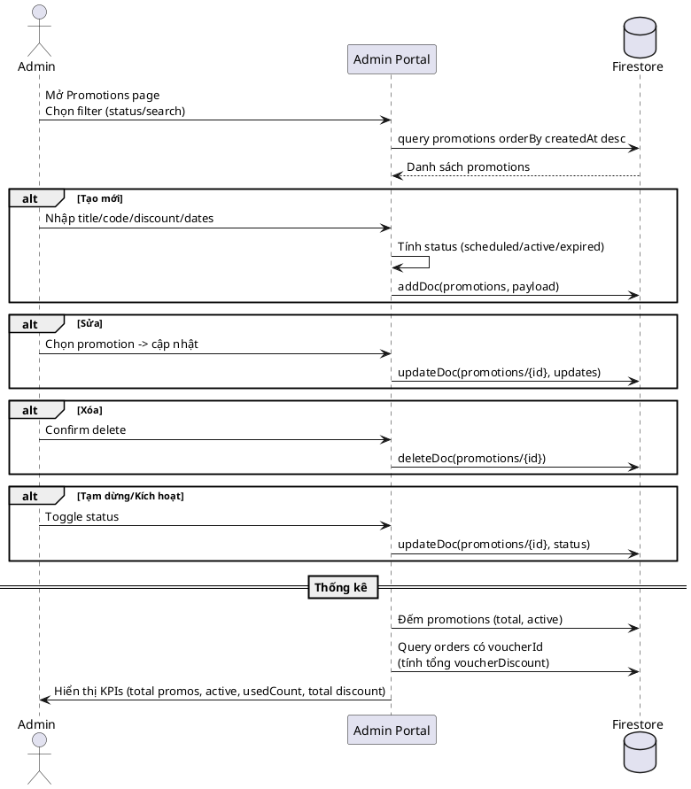
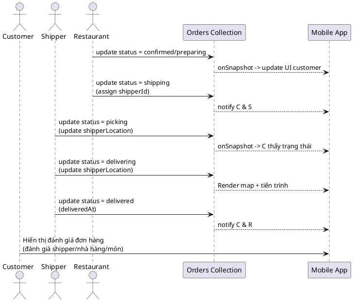

# BIỂU ĐỒ TUẦN TỰ CHÍNH - FOOD ORDER APP

Tài liệu này tổng hợp các luồng tuần tự (Sequence Diagram) quan trọng của hệ thống Food Order App. Mỗi mục gồm mô tả ngắn, các thành phần tham gia và mã PlantUML để vẽ sơ đồ.

---

## 1. Đăng ký tài khoản (Customer / Restaurant / Shipper)

- **Thành phần**: User → App → Firebase Auth → Firestore (`users`, `restaurants`)
- **Mô tả**: Người dùng nhập thông tin, hệ thống kiểm tra trùng lặp, tạo tài khoản Auth và lưu hồ sơ Firestore. Nếu role là `restaurant` thì tạo thêm hồ sơ nhà hàng.

```plantuml
@startuml
actor User
participant "Mobile App" as App
participant "Firebase Auth" as Auth
database "Firestore" as FS

User -> App: Mở màn hình Đăng ký\nnhập email/password/role
App -> FS: query users by username\n(kiểm tra trùng)
FS --> App: Kết quả trùng / không trùng
alt Trùng username
  App -> User: Báo lỗi "Tên đăng nhập đã tồn tại"
  stop
end

App -> Auth: createUserWithEmailAndPassword(email, password)
Auth --> App: uid / lỗi
alt Lỗi Auth
  App -> User: Thông báo lỗi đăng ký
  stop
end

App -> FS: setDoc(users/{uid}, profile)
alt role == restaurant
  App -> FS: setDoc(restaurants/{uid}, restaurantProfile)
end

App -> User: Thông báo thành công\nChuyển đến Login
@enduml
```

---

## 2. Đăng nhập & điều hướng theo role

- **Thành phần**: User → App → Firebase Auth → Firestore (`users`)
- **Mô tả**: Xác thực email/password, lấy profile, kiểm tra role và điều hướng đến app tương ứng (Customer/Restaurant/Shipper/Admin).

```plantuml
@startuml
actor User
participant "Mobile App" as App
participant "Firebase Auth" as Auth
database "Firestore" as FS

User -> App: Nhập email/password\nChọn mode đăng nhập
App -> Auth: signInWithEmailAndPassword
Auth --> App: uid / lỗi
alt Lỗi xác thực
  App -> User: Thông báo lỗi\n(email/mật khẩu không đúng...)
  stop
end

App -> FS: getDoc(users/{uid})
FS --> App: userData / not found
alt Không tìm thấy
  App -> User: Thông báo "Không tìm thấy người dùng"
  stop
end

App -> App: role = userData.role
alt Role khớp mode
  App -> User: Điều hướng:\n- customer -> UserApp\n- restaurant -> RestaurantApp\n- shipper -> ShipperApp\n- admin -> AdminApp
else Sai mode
  App -> User: Thông báo "Sai chế độ đăng nhập"
end
@enduml
```

---

## 3. Tìm kiếm món ăn & xem chi tiết

- **Thành phần**: User → App → Firestore (`foods`, `restaurants`, `ratings`)
- **Mô tả**: Người dùng nhập từ khóa, hệ thống tìm foods/restaurants, hiển thị kết quả; khi chọn món, tải chi tiết, nhà hàng, đánh giá, gợi ý món liên quan.



---

## 4. Đặt món & theo dõi đơn hàng

- **Thành phần**: User → App → Firestore (`carts`, `orders`, `notifications`, `vouchers`) → Shipper → Restaurant
- **Mô tả**: Người dùng thanh toán giỏ hàng, hệ thống tạo đơn theo nhà hàng, gửi thông báo; sau đó theo dõi trạng thái real-time và hiển thị tracking.



---

## 5. Quản lý đơn hàng (Restaurant/Admin)

- **Thành phần**: Restaurant/Admin → App → Firestore (`orders`, `notifications`, `users`)
- **Mô tả**: Lọc/tìm đơn, xem chi tiết, cập nhật trạng thái, gán shipper, gửi thông báo.



---

## 6. Quản lý danh mục & món (Restaurant/Admin)

- **Thành phần**: Restaurant/Admin → App → Firestore (`categories`, `foods`) → Cloudinary
- **Mô tả**: CRUD danh mục, CRUD món (kèm upload ảnh Cloudinary).



---

## 7. Báo cáo thống kê (Restaurant/Admin)

- **Thành phần**: Restaurant/Admin → App → Firestore (`orders`, `users`, `foods`)
- **Mô tả**: Chọn khoảng thời gian, truy vấn orders, tính KPI (doanh thu, số đơn, AOV, tỉ lệ thành công, top món, top khách), hiển thị biểu đồ.



---

## 8. Shipper nhận & giao đơn

- **Thành phần**: Shipper → App → Firestore (`orders`, `notifications`) → Customer/Restaurant
- **Mô tả**: Xem đơn khả dụng, nhận đơn, cập nhật trạng thái, thông báo cho khách và nhà hàng.



---

## 9. Thu nhập & rút tiền (Shipper)

- **Thành phần**: Shipper → App → Firestore (`orders`, `users.wallet`, `withdrawRequests`)
- **Mô tả**: Xem số dư, lịch sử giao đã giao, thống kê, tạo yêu cầu rút tiền và cập nhật ví.



---

## 10. Quản lý người dùng (Admin)

- **Thành phần**: Admin → Admin Portal → Firestore (`users`, `orders`)
- **Mô tả**: Tìm kiếm/lọc user, xem chi tiết, khóa/mở khóa, xóa, tạo mới; tính metadata (số đơn, tổng chi tiêu).



---

## 11. Quản lý khuyến mãi (Admin)

- **Thành phần**: Admin → Admin Portal → Firestore (`promotions`, `orders`)
- **Mô tả**: CRUD promotion, tạm dừng/kích hoạt, thống kê lượt dùng và giá trị giảm giá áp dụng.



---

## 12. Tổng quan tracking giao hàng (Customer - Shipper - Restaurant)

- **Thành phần**: Customer → App, Shipper → App, Restaurant → App, Firestore (`orders`), Maps
- **Mô tả**: Minh họa tương tác 3 bên trong giai đoạn giao hàng và cập nhật vị trí.



---

### Ghi chú
- Các diagram dùng PlantUML, có thể copy vào bất kỳ renderer PlantUML nào để xem hình.
- Các thành phần Firestore và Auth bám sát cấu trúc hiện tại: collections `users`, `restaurants`, `foods`, `categories`, `orders`, `notifications`, `promotions`, `withdrawRequests`, `vouchers`.


