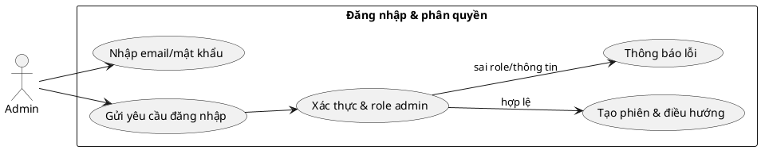
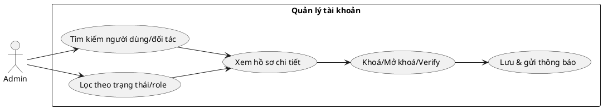
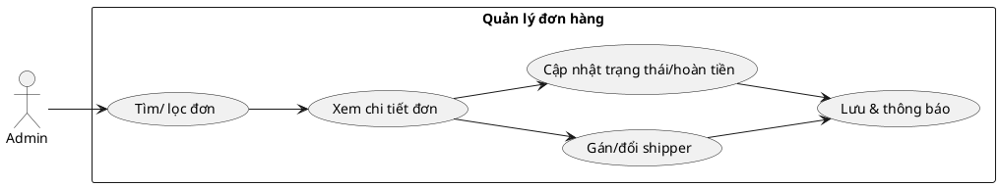
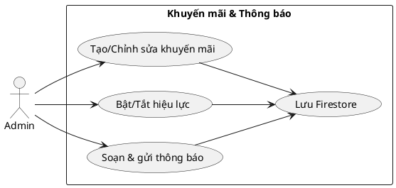
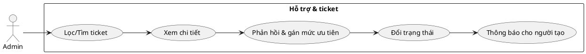
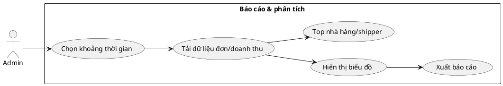
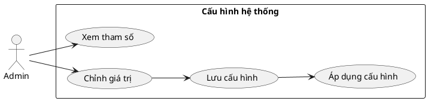
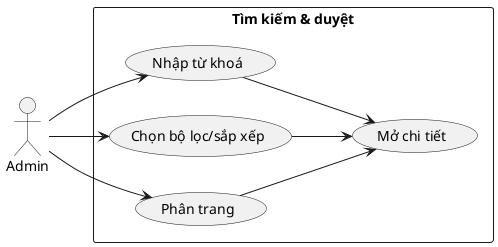
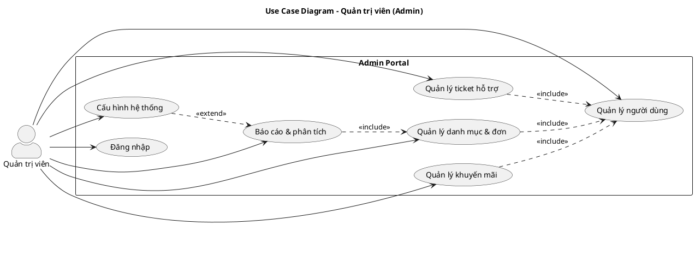

## ĐẶC TẢ USE CASE – ADMIN

Tài liệu mô tả chi tiết các ca sử dụng dành cho Admin trong hệ thống Food Order App. Định dạng tương tự tài liệu Khách hàng: mỗi mục có mô tả và PlantUML riêng.

---

## 1. Đăng nhập & phân quyền

- **Tác nhân**: Quản trị viên.
- **Mô tả**: Đăng nhập portal admin, xác thực Firebase Auth và role `admin`.
- **Tiền điều kiện**: Tài khoản tồn tại và có role `admin`.
- **Luồng sự kiện**:
  1. Mở `Admin Portal` → `Login`.
  2. Nhập email/mật khẩu → xác thực.
  3. Kiểm tra hồ sơ Firestore, role `admin`; nếu không, từ chối và đăng xuất.
  4. Điều hướng vào dashboard.
- **Hậu điều kiện**: Phiên hợp lệ, có quyền truy cập các trang quản trị.

---

## 2. Quản lý người dùng/đối tác (user, nhà hàng, shipper)

- **Mô tả**: Tra cứu, duyệt, khóa/mở khóa tài khoản người dùng, nhà hàng, shipper.
- **Tiền điều kiện**: Đã đăng nhập.
- **Luồng sự kiện**:
  1. Vào `Users`, `Restaurants`, `Drivers`.
  2. Tìm kiếm theo email/số điện thoại/tên; lọc theo trạng thái hoặc role.
  3. Xem chi tiết hồ sơ; cập nhật trạng thái (active/banned/verified).
  4. Lưu Firestore và gửi thông báo nếu cần.
- **Hậu điều kiện**: Tài khoản được kiểm soát đúng quyền/trạng thái.

---

## 3. Quản lý đơn hàng

- **Mô tả**: Theo dõi, lọc, duyệt/cập nhật đơn.
- **Tiền điều kiện**: Đã đăng nhập.
- **Luồng sự kiện**:
  1. Vào `Orders`.
  2. Lọc theo trạng thái, ngày tạo; tìm theo mã đơn.
  3. Mở chi tiết: xem lịch sử, gán/đổi shipper, cập nhật trạng thái, hoàn tiền nếu có.
  4. Ghi nhận thay đổi vào Firestore, gửi thông báo tới khách/nhà hàng/shipper.
- **Hậu điều kiện**: Đơn được giám sát và điều chỉnh kịp thời.

---

## 4. Quản lý khuyến mãi & thông báo

- **Mô tả**: Tạo/sửa/xóa mã giảm giá và gửi thông báo hệ thống.
- **Tiền điều kiện**: Đã đăng nhập.
- **Luồng sự kiện**:
  1. Vào `Promotions`: tạo/activate/deactivate mã (giảm %, tiền, HSD, minOrder, maxDiscount).
  2. Vào `Notifications`: soạn nội dung, chọn nhóm đối tượng (khách, shipper, nhà hàng), gửi.
  3. Lưu vào `promotions`/`notifications`; trigger hiển thị ở app tương ứng.
- **Hậu điều kiện**: Ưu đãi và thông báo được phát hành đúng đối tượng.

---

## 5. Hỗ trợ & ticket

- **Mô tả**: Xử lý ticket hỗ trợ từ khách/shipper/nhà hàng.
- **Tiền điều kiện**: Đã đăng nhập.
- **Luồng sự kiện**:
  1. Vào `Support`.
  2. Lọc ticket theo trạng thái (open/pending/resolved); tìm theo từ khóa.
  3. Mở chi tiết, phản hồi, gán mức ưu tiên, đổi trạng thái.
  4. Gửi thông báo cập nhật cho người tạo.
- **Hậu điều kiện**: Ticket được giải quyết/đóng; người dùng nhận phản hồi.

---

## 6. Báo cáo & phân tích

- **Mô tả**: Xem dashboard doanh thu, đơn, hiệu suất shipper/nhà hàng.
- **Tiền điều kiện**: Có dữ liệu đơn và người dùng.
- **Luồng sự kiện**:
  1. Vào `Reports`: chọn khoảng thời gian.
  2. Xem biểu đồ doanh thu, số đơn, top nhà hàng/shipper.
  3. Xuất báo cáo (nếu có).
- **Hậu điều kiện**: Số liệu được giám sát, hỗ trợ quyết định vận hành.

---

## 7. Cấu hình hệ thống

- **Mô tả**: Chỉnh các tham số hệ thống (phí ship mặc định, ngưỡng khuyến mãi, feature flags).
- **Tiền điều kiện**: Đã đăng nhập, có quyền cấu hình.
- **Luồng sự kiện**:
  1. Vào `Config`.
  2. Chỉnh các tham số vận hành.
  3. Lưu cấu hình; áp dụng cho dịch vụ liên quan.
- **Hậu điều kiện**: Hệ thống vận hành theo cấu hình mới.

---

## 8. Tìm kiếm & duyệt dữ liệu (chung)

- **Mô tả**: Tất cả bảng dữ liệu có tìm kiếm, lọc, sắp xếp, phân trang.
- **Tiền điều kiện**: Đã đăng nhập.
- **Luồng sự kiện**:
  1. Nhập từ khóa (mã đơn, tên nhà hàng, email, SĐT).
  2. Chọn bộ lọc trạng thái, ngày, role; sắp xếp cột (thời gian, số tiền, trạng thái).
  3. Hệ thống hiển thị bảng với phân trang; mở chi tiết để thao tác.
- **Hậu điều kiện**: Admin thao tác nhanh trên dữ liệu cần quản trị.

---

### Sơ đồ use case tổng quan (khớp file `So_Do_Use_Case_Admin.puml`)

