# ĐẶC TẢ USE CASE – KHÁCH HÀNG (CUSTOMER)

Tài liệu mô tả chi tiết các ca sử dụng dành cho khách hàng trong hệ thống Food Order App. Mỗi mục gồm phần mô tả và đoạn mã PlantUML để thuận tiện dựng sơ đồ.

---

## 1. Đăng ký tài khoản

- **Tác nhân**: Khách hàng.
- **Mô tả**: Người dùng tạo tài khoản mới để bắt đầu sử dụng ứng dụng đặt đồ ăn.
- **Tiền điều kiện**: Người dùng chưa có tài khoản.
- **Luồng sự kiện**:
  1. Người dùng chọn chức năng `Đăng ký`.
  2. Nhập thông tin bắt buộc: họ tên, email, mật khẩu, số điện thoại (hoặc tài khoản mạng xã hội).
  3. Hệ thống kiểm tra tính hợp lệ (email không trùng, mật khẩu đạt yêu cầu, số điện thoại đúng định dạng).
  4. Hệ thống lưu thông tin vào cơ sở dữ liệu.
  5. (Tuỳ chọn) Hệ thống gửi email hoặc OTP xác minh, người dùng nhập mã xác nhận.
- **Hậu điều kiện**: Tài khoản mới được tạo và có thể dùng để đăng nhập.

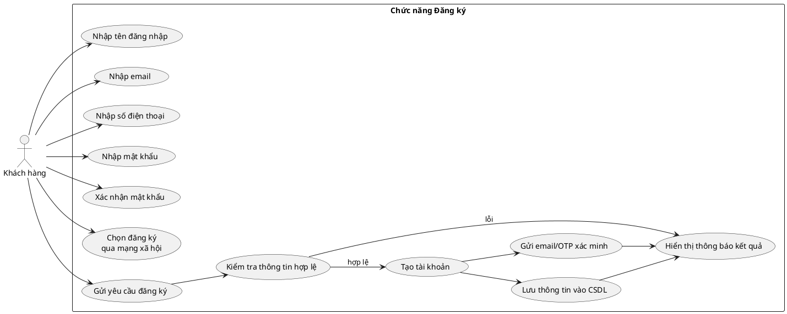

---

## 2. Đăng nhập

- **Tác nhân**: Khách hàng.
- **Mô tả**: Người dùng truy cập ứng dụng bằng email/mật khẩu hoặc tài khoản liên kết (Google, Apple...).
- **Tiền điều kiện**: Đã có tài khoản và trạng thái tài khoản không bị khoá.
- **Luồng sự kiện**:
  1. Chọn `Đăng nhập`.
  2. Nhập email/mật khẩu (hoặc chọn đăng nhập bằng Google).
  3. Hệ thống xác thực thông tin.
  4. Nếu thành công, hệ thống tạo phiên và chuyển đến màn hình chính.
- **Hậu điều kiện**: Người dùng đăng nhập thành công, hệ thống lưu token phiên.

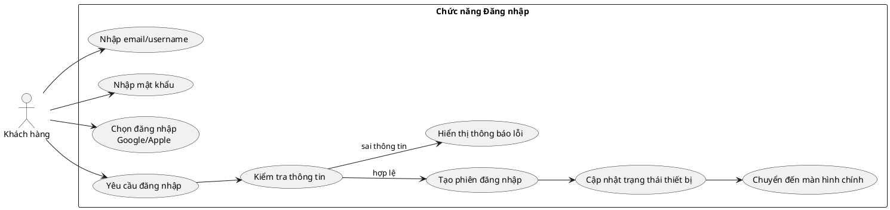

---

## 3. Quản lý hồ sơ & cài đặt

- **Tác nhân**: Khách hàng.
- **Mô tả**: Xem/chỉnh sửa thông tin cá nhân, số điện thoại, avatar, thay đổi mật khẩu, thiết lập thông báo.
- **Tiền điều kiện**: Đã đăng nhập.
- **Luồng sự kiện**:
  1. Người dùng mở trang `Hồ sơ`.
  2. Thực hiện chỉnh sửa (tên, số điện thoại, ảnh đại diện, cài đặt thông báo, chế độ tối, bảo mật...).
  3. Hệ thống xác thực lại nếu thao tác nhạy cảm (đổi mật khẩu).
  4. Hệ thống lưu thay đổi.
- **Hậu điều kiện**: Thông tin mới được cập nhật, thống kê cá nhân được làm mới.

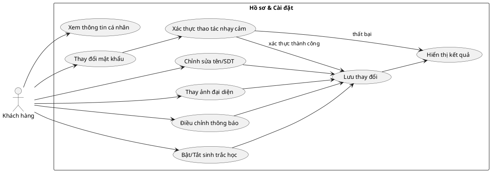

---

## 4. Quản lý địa chỉ giao hàng

- **Tác nhân**: Khách hàng.
- **Mô tả**: Người dùng thêm/sửa/xoá địa chỉ, đặt địa chỉ mặc định.
- **Tiền điều kiện**: Đã đăng nhập.
- **Luồng sự kiện**:
  1. Chọn `Sổ địa chỉ`.
  2. Thêm địa chỉ mới (tên địa điểm, số nhà, ghi chú).
  3. Hệ thống xác thực thông tin, gợi ý vị trí từ bản đồ (nếu có).
  4. Người dùng có thể sửa hoặc đặt mặc định, hoặc xoá.
- **Hậu điều kiện**: Danh sách địa chỉ được cập nhật, địa chỉ mặc định dùng cho lần đặt kế tiếp.

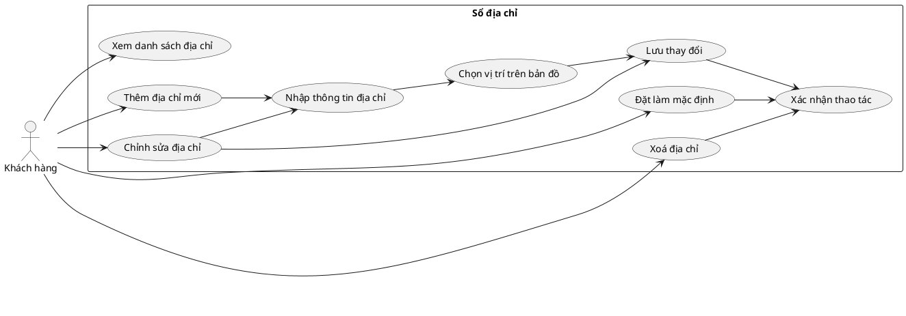

---

## 5. Quản lý phương thức thanh toán

- **Tác nhân**: Khách hàng.
- **Mô tả**: Lưu trữ/xoá thẻ ngân hàng, ví điện tử, thiết lập mặc định.
- **Tiền điều kiện**: Đã đăng nhập.
- **Luồng sự kiện**:
  1. Truy cập `Phương thức thanh toán`.
  2. Nhập thông tin thẻ/ví (số thẻ, tên chủ, ngày hết hạn...).
  3. Hệ thống kiểm tra định dạng, mã hoá và lưu.
  4. Người dùng đặt phương thức mặc định, có thể xoá khi không dùng.
- **Hậu điều kiện**: Phương thức thanh toán được cập nhật, sẵn sàng chọn trong bước checkout.

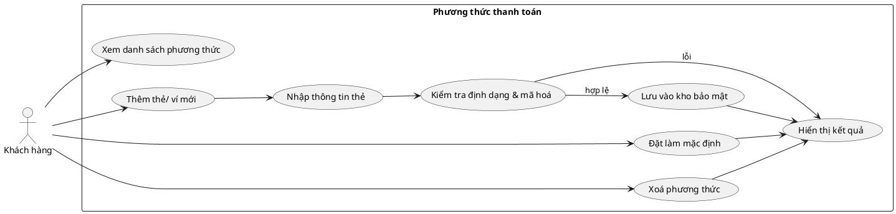

---

## 6. Tìm kiếm & duyệt nhà hàng/món

- **Tác nhân**: Khách hàng.
- **Mô tả**: Duyệt danh sách nhà hàng, món ăn, sử dụng bộ lọc, xem chi tiết.
- **Tiền điều kiện**: Đăng nhập (hoặc khách vãng lai nếu được phép).
- **Luồng sự kiện**:
  1. Người dùng vào trang `Trang chủ` hoặc `Nhà hàng`.
  2. Nhập từ khoá tìm kiếm hoặc chọn bộ lọc (khoảng cách, giá, đánh giá).
  3. Hệ thống hiển thị kết quả, người dùng xem chi tiết từng nhà hàng, menu, đánh giá.
  4. Từ chi tiết món, người dùng có thể thêm vào giỏ.
- **Hậu điều kiện**: Người dùng chọn được món/nhà hàng phù hợp để đặt.

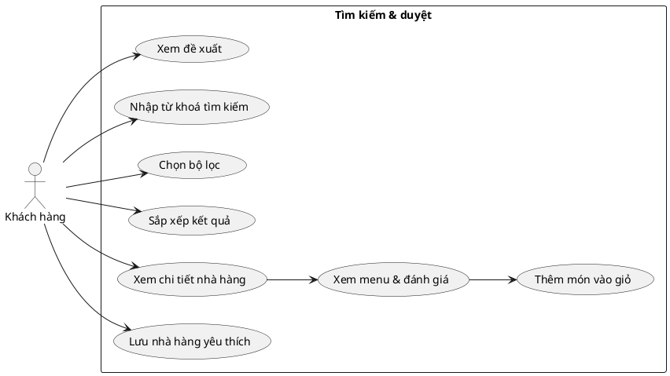

---

## 7. Quản lý giỏ hàng & đặt món

- **Tác nhân**: Khách hàng.
- **Mô tả**: Thêm món vào giỏ, cập nhật số lượng, áp dụng voucher và thực hiện thanh toán.
- **Tiền điều kiện**: Đã chọn món và có địa chỉ hợp lệ.
- **Luồng sự kiện**:
  1. Thêm món từ trang chi tiết vào giỏ.
  2. Vào `Giỏ hàng` để xem danh sách, tăng/giảm/Xoá món.
  3. Chọn địa chỉ, phương thức thanh toán, áp mã giảm giá nếu có.
  4. Xác nhận đơn hàng, hệ thống tạo đơn và thông báo đến nhà hàng.
- **Hậu điều kiện**: Đơn hàng ở trạng thái `pending`, giỏ hàng được làm trống.

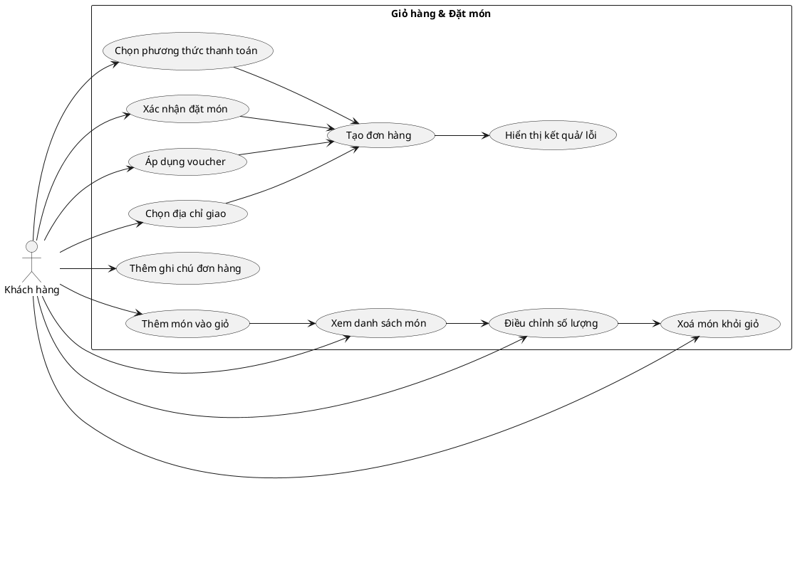

---

## 8. Theo dõi đơn hàng

- **Tác nhân**: Khách hàng.
- **Mô tả**: Kiểm tra trạng thái đơn theo thời gian thực, xem thông tin nhà hàng và tài xế.
- **Tiền điều kiện**: Đã có đơn hàng đang xử lý.
- **Luồng sự kiện**:
  1. Người dùng mở `Đơn hàng`.
  2. Chọn một đơn để xem chi tiết (trạng thái, thời gian dự kiến, thông tin shipper).
  3. Hệ thống cập nhật trạng thái real-time; người dùng có thể huỷ nếu đơn còn chờ xác nhận.
- **Hậu điều kiện**: Người dùng nắm rõ tiến trình, có thể đánh giá sau khi hoàn tất.

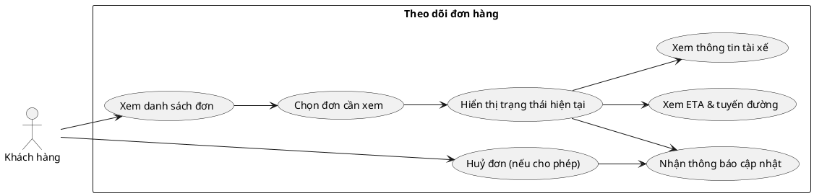

---

## 9. Quản lý voucher

- **Tác nhân**: Khách hàng.
- **Mô tả**: Xem danh sách voucher cá nhân, điều kiện áp dụng, tình trạng sử dụng.
- **Tiền điều kiện**: Đã đăng nhập.
- **Luồng sự kiện**:
  1. Người dùng mở `Voucher của tôi`.
  2. Hệ thống hiển thị các voucher hợp lệ, sắp xếp theo hạn dùng/trạng thái.
  3. Người dùng chọn voucher khi checkout hoặc đánh dấu đã dùng.
- **Hậu điều kiện**: Voucher được gắn kết với đơn hàng hoặc cập nhật trạng thái đã sử dụng.

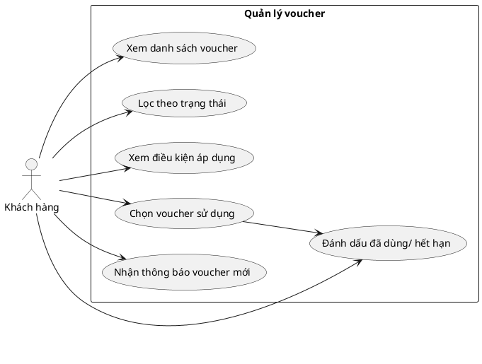

---

## 10. Đánh giá & phản hồi

- **Tác nhân**: Khách hàng.
- **Mô tả**: Gửi đánh giá sau khi đơn hoàn thành cho nhà hàng, tài xế, từng món.
- **Tiền điều kiện**: Đơn hàng ở trạng thái `delivered`.
- **Luồng sự kiện**:
  1. Người dùng mở đơn đã hoàn thành.
  2. Nhập số sao, bình luận cho nhà hàng/tài xế/món.
  3. Hệ thống lưu đánh giá, tính điểm trung bình và hiện cảnh báo nếu nội dung vi phạm.
- **Hậu điều kiện**: Đánh giá được lưu, đóng góp vào xếp hạng hệ thống.

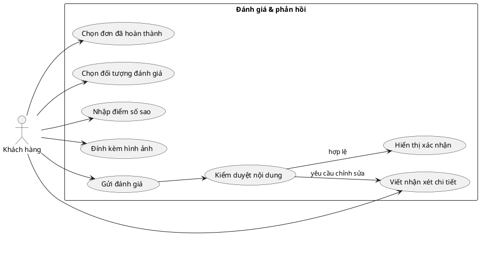

---

## 11. Thông báo & nhắc nhở

- **Tác nhân**: Khách hàng.
- **Mô tả**: Nhận thông báo về trạng thái đơn, khuyến mãi, nhắc nhở.
- **Tiền điều kiện**: Đã bật quyền thông báo.
- **Luồng sự kiện**:
  1. Hệ thống gửi thông báo khi có sự kiện (đơn đổi trạng thái, voucher mới).
  2. Người dùng vào `Thông báo` để đọc chi tiết, đánh dấu đã đọc hoặc xoá.
- **Hậu điều kiện**: Người dùng cập nhật thông tin kịp thời, hộp thông báo sạch sẽ.

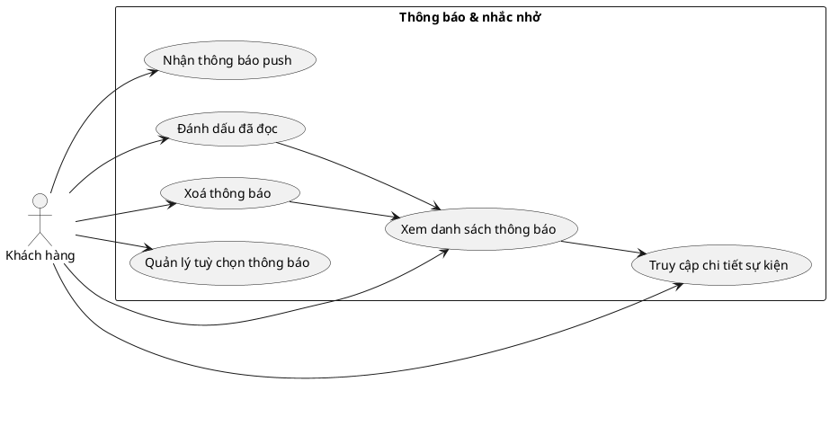

---

## 12. Trung tâm trợ giúp

- **Tác nhân**: Khách hàng.
- **Mô tả**: Tra cứu FAQ, gửi yêu cầu hỗ trợ hoặc khiếu nại.
- **Tiền điều kiện**: Đăng nhập (đối với gửi ticket).
- **Luồng sự kiện**:
  1. Người dùng mở `Trợ giúp`.
  2. Tìm kiếm câu hỏi hoặc tạo ticket mới với nội dung chi tiết.
  3. Hệ thống ghi nhận và phản hồi qua email/thông báo khi có kết quả.
- **Hậu điều kiện**: Ticket được tạo và gán mức độ ưu tiên; người dùng nhận được cập nhật.

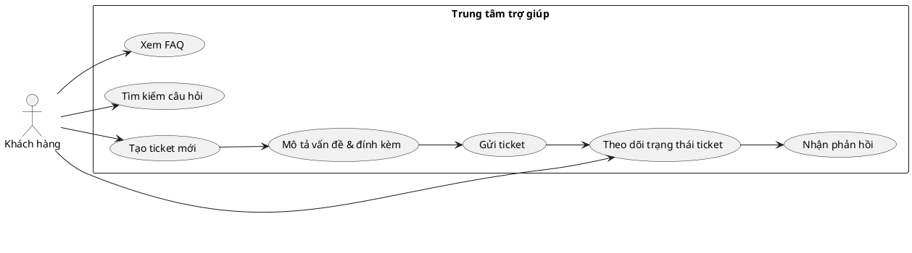

---

## 13. Trợ lý AI/Chatbot

- **Tác nhân**: Khách hàng.
- **Mô tả**: Tương tác với chatbot để hỏi thông tin món ăn, hỗ trợ đặt đơn, xử lý sự cố.
- **Tiền điều kiện**: Đăng nhập.
- **Luồng sự kiện**:
  1. Người dùng mở `Chatbot AI`.
  2. Nhập câu hỏi/nhu cầu (gợi ý món, hỏi trạng thái đơn, báo sự cố).
  3. Chatbot phản hồi thời gian thực; nếu cần, chuyển sang hỗ trợ viên.
- **Hậu điều kiện**: Người dùng nhận được tư vấn nhanh, vấn đề có thể được giải quyết hoặc escalated.

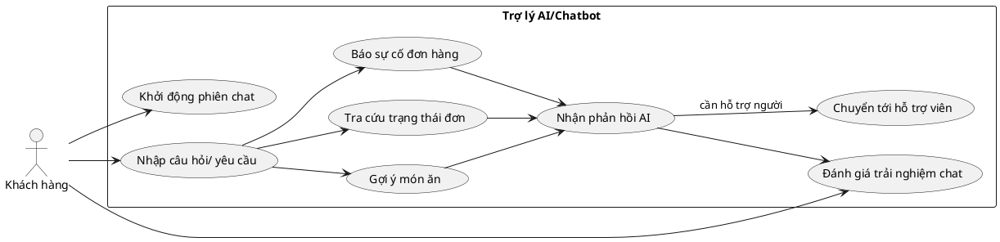

