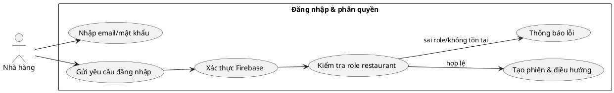
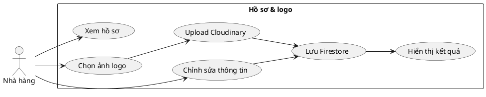
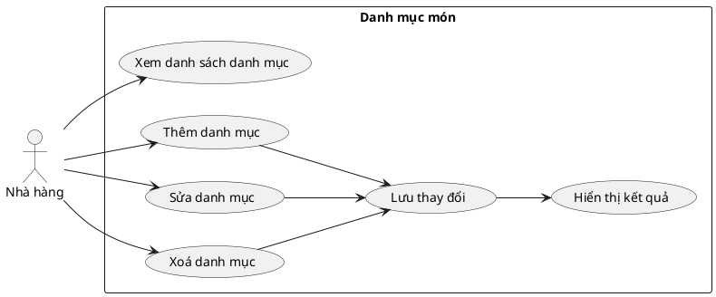
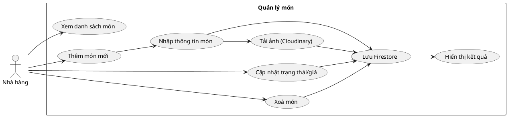
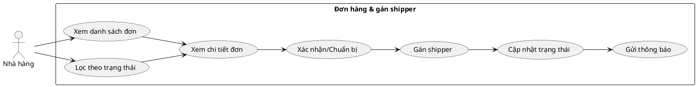
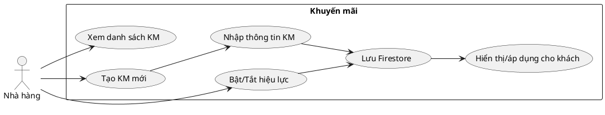
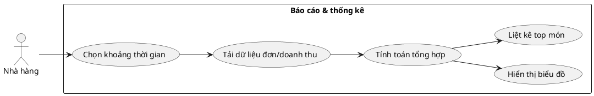
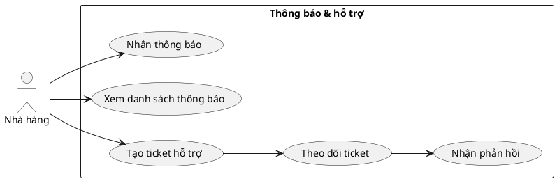
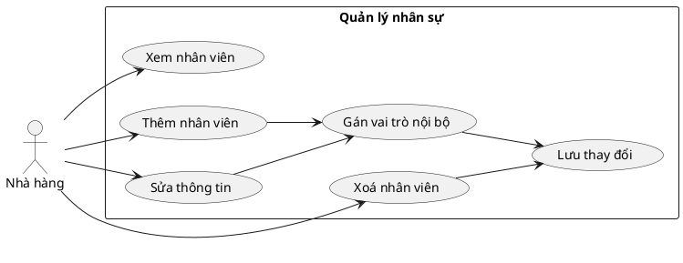
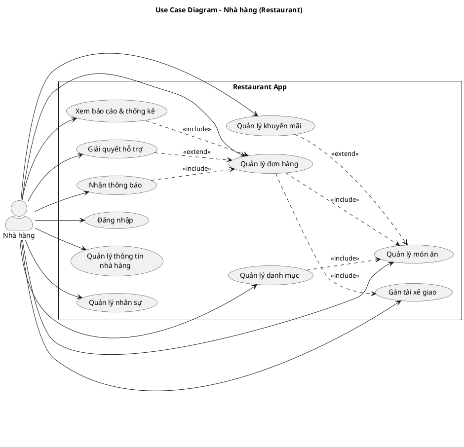

## ĐẶC TẢ USE CASE – NHÀ HÀNG (RESTAURANT)

Tài liệu mô tả chi tiết các ca sử dụng dành cho Nhà hàng trong hệ thống Food Order App. Mỗi mục gồm phần mô tả và đoạn mã PlantUML để dựng sơ đồ giống định dạng của tài liệu Khách hàng.

---

## 1. Đăng nhập & phân quyền

- **Tác nhân**: Chủ/quản trị nhà hàng.
- **Mô tả**: Đăng nhập app nhà hàng, xác thực Firebase Auth, kiểm tra role `restaurant`.
- **Tiền điều kiện**: Tài khoản đã được cấp quyền `restaurant`.
- **Luồng sự kiện**:
  1. Mở app nhà hàng → màn `Login`.
  2. Nhập email/mật khẩu → hệ thống xác thực.
  3. Kiểm tra hồ sơ trong `users` với role `restaurant`; nếu sai role, từ chối.
  4. Điều hướng vào trang chủ/đơn hàng.
- **Hậu điều kiện**: Phiên đăng nhập hợp lệ, token lưu để gọi API/Firestore.

---

## 2. Quản lý hồ sơ & logo nhà hàng

- **Mô tả**: Cập nhật tên, địa chỉ, giờ mở cửa, logo (Cloudinary) và lưu `restaurants/{uid}`.
- **Tiền điều kiện**: Đã đăng nhập.
- **Luồng sự kiện**:
  1. Vào `Tài khoản nhà hàng`.
  2. Chỉnh sửa thông tin, chọn ảnh logo → upload Cloudinary → lấy `logoUrl`.
  3. Lưu Firestore: `restaurants/{uid}` cập nhật `logoUrl` và thông tin.
  4. Màn khách/nhà hàng hiển thị logo mới (ưu tiên `logoUrl`).
- **Hậu điều kiện**: Hồ sơ đồng bộ, logo hiển thị đúng cho khách.

---

## 3. Quản lý danh mục món

- **Mô tả**: Tạo/sửa/xóa danh mục món; liên kết với menu.
- **Tiền điều kiện**: Đã đăng nhập.
- **Luồng sự kiện**:
  1. Vào `Quản lý danh mục`.
  2. Thêm mới (tên, mô tả, ưu tiên) hoặc sửa/xóa danh mục.
  3. Hệ thống cập nhật Firestore `categories`.
- **Hậu điều kiện**: Danh mục sẵn sàng gắn vào món; menu được phân loại.

---

## 4. Quản lý món ăn

- **Mô tả**: CRUD món, đặt trạng thái `isAvailable`, giá, mô tả, ảnh.
- **Tiền điều kiện**: Đã có danh mục liên quan (nếu ràng buộc).
- **Luồng sự kiện**:
  1. Vào `Quản lý món`.
  2. Thêm mới: nhập thông tin, chọn danh mục, tải ảnh (Cloudinary tùy chọn).
  3. Sửa: cập nhật giá/trạng thái/ảnh; Xóa: ngừng bán.
  4. Lưu Firestore `foods`.
- **Hậu điều kiện**: Món sẵn sàng hiển thị cho khách; trạng thái phản ánh thực tế.

---

## 5. Quản lý đơn hàng & gán shipper

- **Mô tả**: Xem/lọc đơn, cập nhật trạng thái, gán shipper.
- **Tiền điều kiện**: Đã đăng nhập; có đơn hàng trong hệ thống.
- **Luồng sự kiện**:
  1. Vào `Quản lý đơn hàng`.
  2. Lọc theo trạng thái (`pending`, `confirmed`, `preparing`, `shipping`, `delivered`, `cancelled`).
  3. Mở chi tiết → xác nhận/chuẩn bị → gán shipper (nếu cần) → cập nhật trạng thái.
  4. Hệ thống ghi Firestore `orders`, gửi thông báo tới khách/shipper.
- **Hậu điều kiện**: Đơn được cập nhật đúng, các bên nhận thông báo.

---

## 6. Khuyến mãi

- **Mô tả**: Tạo/sửa khuyến mãi áp dụng cho nhà hàng.
- **Tiền điều kiện**: Đã đăng nhập.
- **Luồng sự kiện**:
  1. Vào `Khuyến mãi`.
  2. Nhập tiêu đề, mô tả, mã, giá trị giảm, HSD, điều kiện tối thiểu.
  3. Lưu Firestore `promotions` (trạng thái hoạt động).
- **Hậu điều kiện**: Mã giảm áp dụng cho khách; hiển thị ở app khách.

---

## 7. Báo cáo & thống kê

- **Mô tả**: Xem doanh thu, số đơn, top món bán chạy, công nợ.
- **Tiền điều kiện**: Có dữ liệu đơn/món.
- **Luồng sự kiện**:
  1. Vào `Thống kê/Báo cáo`.
  2. Chọn khoảng thời gian, tải dữ liệu đơn/doanh thu.
  3. Hệ thống tính tổng, vẽ biểu đồ, liệt kê top món.
- **Hậu điều kiện**: Nhà hàng nắm hiệu suất để điều chỉnh vận hành.

---

## 8. Thông báo & hỗ trợ

- **Mô tả**: Nhận thông báo hệ thống; gửi ticket hỗ trợ.
- **Tiền điều kiện**: Đã đăng nhập.
- **Luồng sự kiện**:
  1. Hệ thống đẩy `notifications` (đơn mới, trạng thái, ví…) hiển thị trong app.
  2. Với sự cố, vào `Hỗ trợ` → nhập nội dung → tạo ticket Firestore `support`.
  3. Admin phản hồi; nhà hàng nhận thông báo cập nhật.
- **Hậu điều kiện**: Vấn đề được ghi nhận; nhà hàng nhận thông tin kịp thời.

---

## 9. Quản lý nhân sự (nội bộ)

- **Mô tả**: Quản lý nhân viên phục vụ/bếp, gán quyền nội bộ.
- **Tiền điều kiện**: Đã đăng nhập với quyền quản lý nhà hàng.
- **Luồng sự kiện**:
  1. Vào `Quản lý nhân sự`.
  2. Thêm/sửa/xóa nhân viên; gán vai trò (bếp/phục vụ/quản lý).
  3. Lưu thông tin (Firestore hoặc hệ thống phụ trợ).
- **Hậu điều kiện**: Nhân sự được phân quyền rõ ràng cho vận hành.

---

### Sơ đồ use case tổng quan (khớp file `So_Do_Use_Case_NhaHang.puml`)

