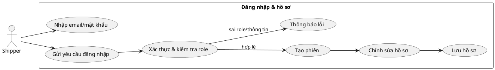
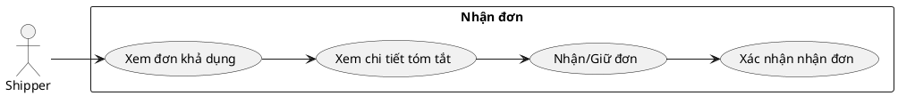
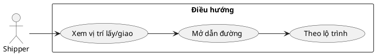
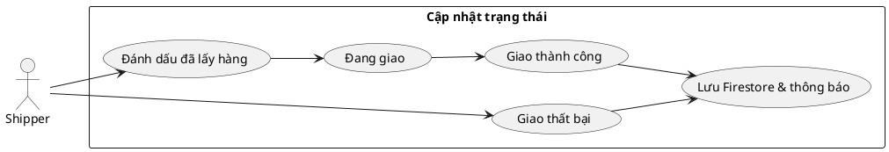
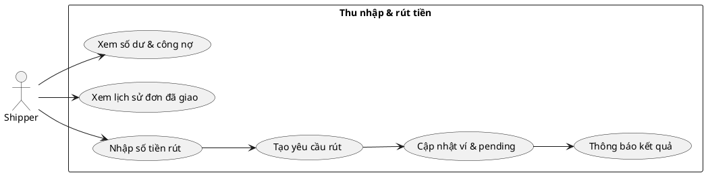
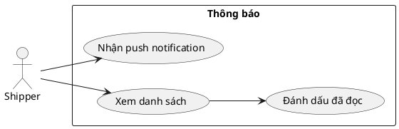
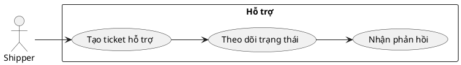
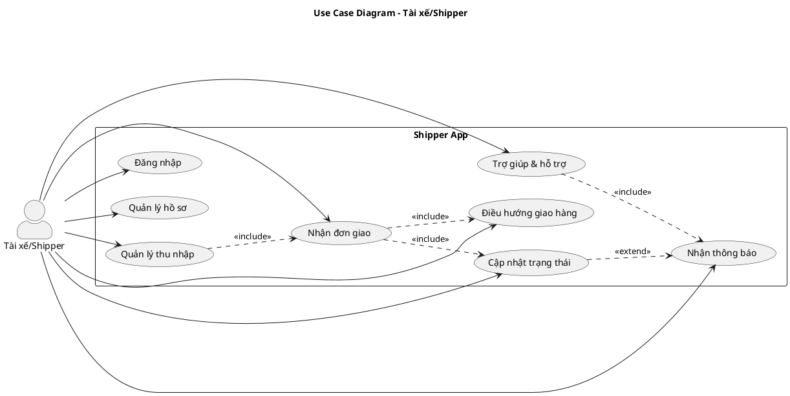

## ĐẶC TẢ USE CASE – SHIPPER

Tài liệu mô tả chi tiết các ca sử dụng dành cho Shipper trong hệ thống Food Order App. Mỗi mục gồm mô tả và PlantUML tương tự định dạng của tài liệu Khách hàng.

---

## 1. Đăng nhập & hồ sơ

- **Tác nhân**: Shipper.
- **Mô tả**: Đăng nhập app shipper, xác thực role `shipper`, cập nhật thông tin cá nhân.
- **Tiền điều kiện**: Có tài khoản shipper đã được duyệt.
- **Luồng sự kiện**:
  1. Mở app → `Login` → nhập email/mật khẩu.
  2. Hệ thống xác thực, kiểm tra role `shipper`.
  3. Vào `Hồ sơ` để cập nhật ảnh đại diện, số điện thoại, biển số xe.
- **Hậu điều kiện**: Phiên đăng nhập hợp lệ; hồ sơ sẵn sàng nhận đơn.

---

## 2. Nhận đơn

- **Mô tả**: Nhận/gán đơn; xem danh sách đơn khả dụng hoặc được gán.
- **Tiền điều kiện**: Đã đăng nhập; có đơn khả dụng.
- **Luồng sự kiện**:
  1. Vào `Đơn hàng` → tab đơn khả dụng/được gán.
  2. Chọn đơn → xem tóm tắt lấy/giao.
  3. Nhận đơn (hoặc xác nhận đơn được gán).
- **Hậu điều kiện**: Đơn được shipper tiếp nhận.

---

## 3. Điều hướng giao hàng

- **Mô tả**: Xem lộ trình trên bản đồ, dẫn đường đến điểm lấy/giao.
- **Tiền điều kiện**: Đã nhận đơn.
- **Luồng sự kiện**:
  1. Mở chi tiết đơn.
  2. Xem vị trí lấy/giao, mở điều hướng (Google Maps/MapView).
  3. Di chuyển theo lộ trình.
- **Hậu điều kiện**: Sẵn sàng cập nhật trạng thái.

---

## 4. Cập nhật trạng thái giao hàng

- **Mô tả**: Thay đổi trạng thái đơn trong suốt quá trình giao.
- **Tiền điều kiện**: Đơn đã nhận.
- **Luồng sự kiện**:
  1. Từ chi tiết đơn, cập nhật: `picked_up` → `delivering` → `delivered` hoặc `failed`.
  2. Hệ thống lưu Firestore `orders`, gửi thông báo cho khách/nhà hàng.
- **Hậu điều kiện**: Trạng thái đơn nhất quán; các bên được thông báo.

---

## 5. Quản lý thu nhập & rút tiền

- **Mô tả**: Xem số dư, công nợ, lịch sử giao dịch; yêu cầu rút tiền.
- **Tiền điều kiện**: Đã đăng nhập, có ví.
- **Luồng sự kiện**:
  1. Vào `Tài chính`.
  2. Hệ thống tính số dư từ đơn đã giao, hiển thị công nợ/chiết khấu.
  3. Nhập số tiền rút → tạo `withdrawRequests`, cập nhật ví shipper.
- **Hậu điều kiện**: Yêu cầu rút được ghi nhận; số dư/pending được cập nhật.

---

## 6. Thông báo

- **Mô tả**: Nhận thông báo hệ thống (đơn mới, trạng thái, thanh toán).
- **Tiền điều kiện**: Đã đăng nhập.
- **Luồng sự kiện**:
  1. Hệ thống đẩy `notifications` đến app; hiển thị danh sách.
  2. Shipper mở thông báo, đánh dấu đã đọc.
- **Hậu điều kiện**: Shipper nắm thông tin kịp thời.

---

## 7. Hỗ trợ & ticket

- **Mô tả**: Gửi ticket hỗ trợ và nhận phản hồi.
- **Tiền điều kiện**: Đã đăng nhập.
- **Luồng sự kiện**:
  1. Vào `Trợ giúp` → nhập nội dung → tạo ticket `support`.
  2. Theo dõi trạng thái, nhận phản hồi qua thông báo.
- **Hậu điều kiện**: Vấn đề được ghi nhận; shipper nhận phản hồi.

---

### Sơ đồ use case tổng quan (khớp file `So_Do_Use_Case_Shipper.puml`)

